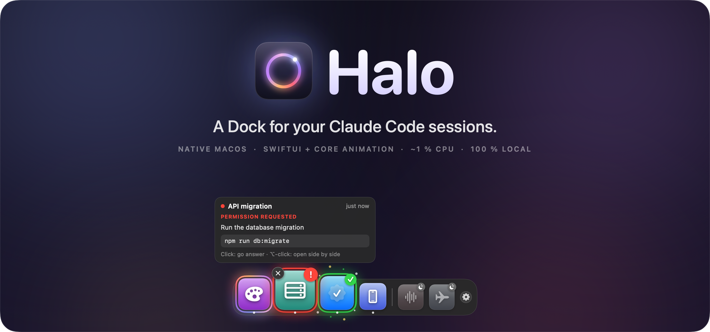
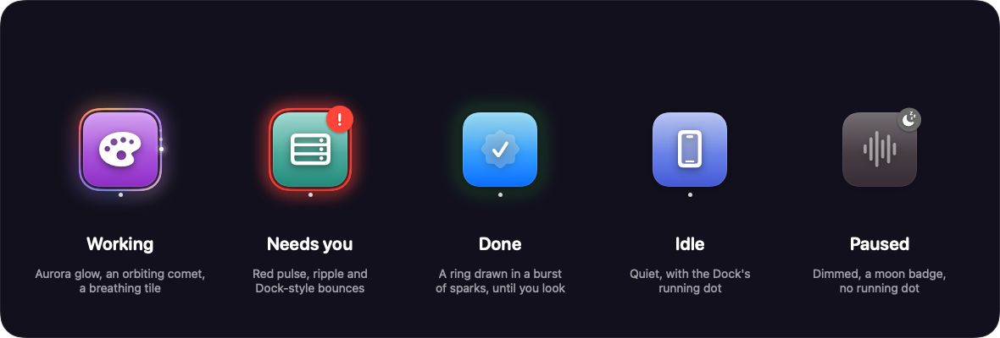
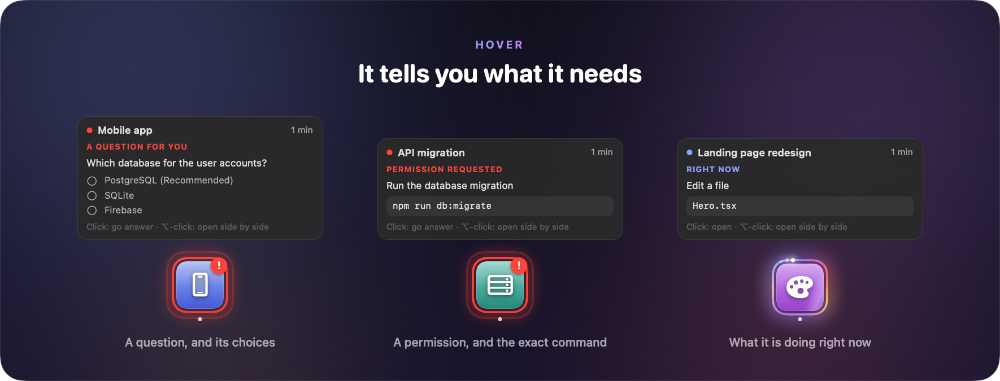
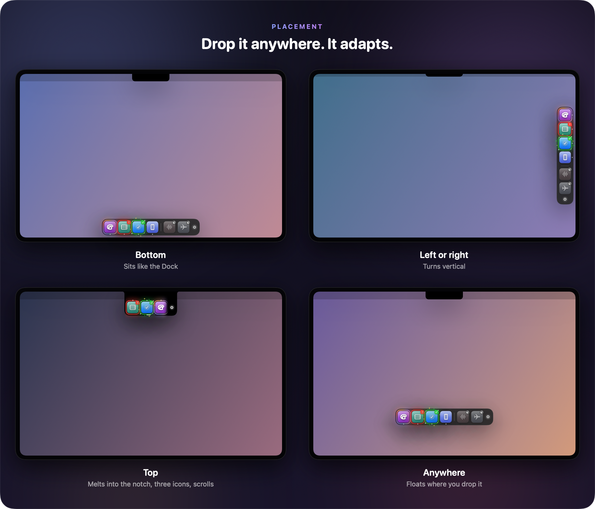
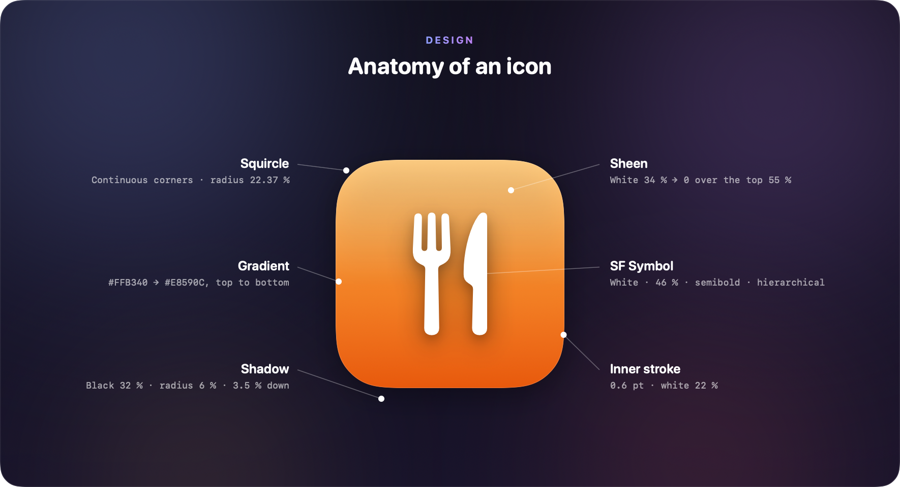
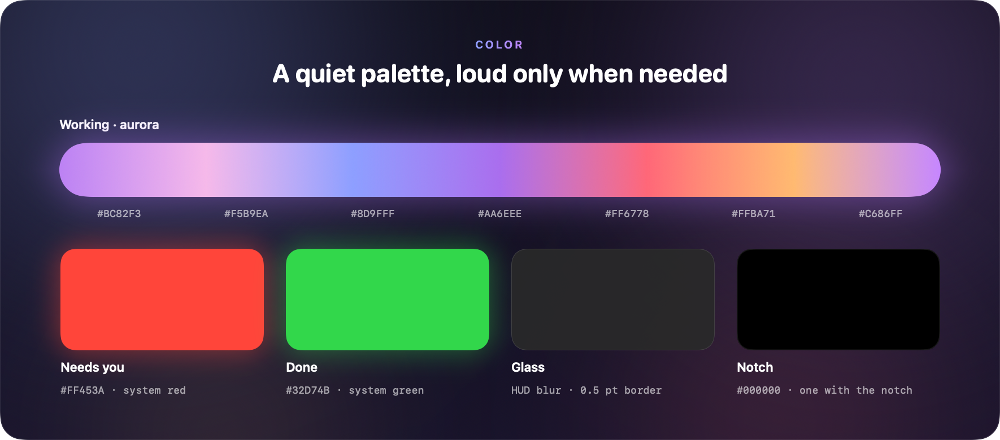
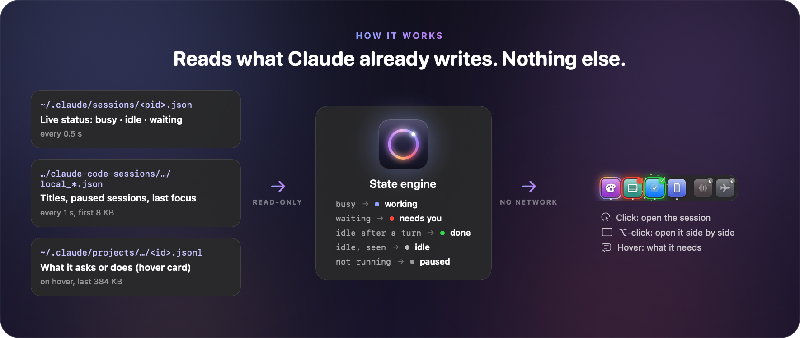
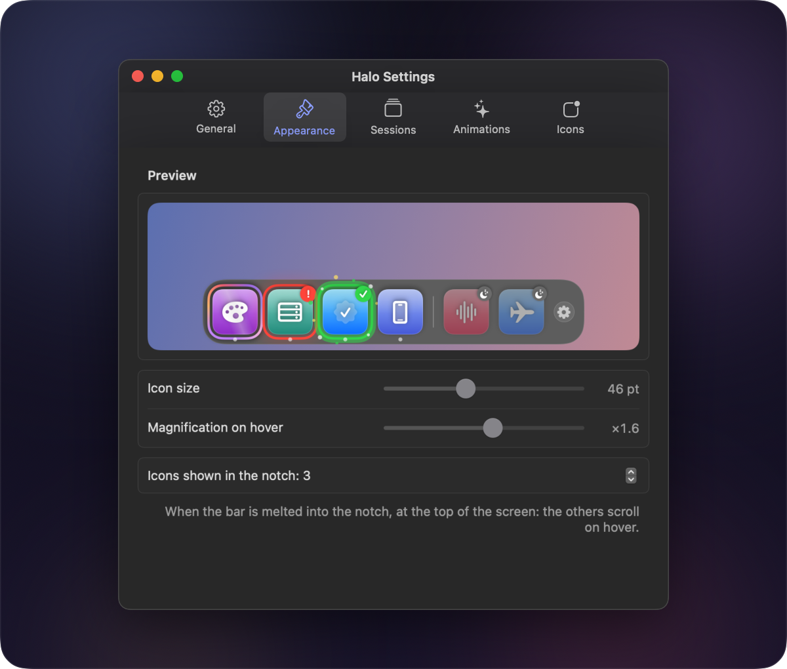
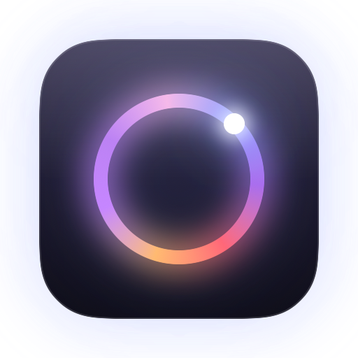

<p align="center">
  
</p>

<p align="center">
  
  
  
  
  
  
</p>

<p align="center">
  <b>One icon per Claude session. Motion only when something needs you.</b><br>
  <sub>Built for the Claude desktop app. No hooks, no setup, nothing leaves your Mac.</sub>
</p>

<p align="center">
  <a href="#install"><b>Install</b></a> ·
  <a href="#the-five-states">States</a> ·
  <a href="#hover-it-tells-you-what-it-needs">Hover card</a> ·
  <a href="#drop-it-anywhere">Placement</a> ·
  <a href="#design">Design</a> ·
  <a href="#how-it-works">How it works</a> ·
  <a href="#settings">Settings</a>
</p>

---

## Why Halo

Working with an AI coding agent means waiting. With three or four Claude sessions running in parallel, you keep switching between them just to check whether one has finished or is stuck on a question. Every check breaks your focus. Meanwhile, a session can sit idle for ten minutes because nobody saw its question.

**Halo puts that information in your peripheral vision**, the way the macOS Dock does for apps: each session gets its own Apple-style icon in a floating bar.

> **Prior art.** Before building it, I surveyed about 25 open-source projects that show Claude Code status on a Mac, from notch companions (*coucou*, *open-vibe-island*, *notchi*) to floating panels (*ccglance*). Almost all of them watch **terminal** sessions and live in the **notch**. Halo is built for the **Claude desktop app** first, takes the shape of the **Dock**, and needs **no hooks**.

---

## The five states

<p align="center">
  
</p>

| State | You see | It means |
|---|---|---|
| **Working** | Aurora glow, an orbiting comet, a breathing tile | Claude is running a turn |
| **Needs you** | Red pulse, a ripple, Dock-style bounces, `!` badge | A question or a permission is waiting for you |
| **Done** | A green ring drawn in a burst of sparks, `✓` badge | The turn ended after you last looked at the session |
| **Idle** | A quiet icon with the Dock's running dot | Nothing to do, already seen |
| **Paused** | Dimmed icon, moon badge, no running dot | In the Claude app's list, but not running |

The green state clears itself as soon as you open the session in the Claude app.

---

## Hover: it tells you what it needs

<p align="center">
  
</p>

Hover any icon to see a small card: the **exact question** with its choices, the **command or file** a permission is about, what the session is **doing right now**, or the first lines of its **last reply**. It is read from the session's transcript on your disk: no API key, no network, no cost.

| Gesture | What happens |
|---|---|
| **Click** | Jumps to that session in the Claude app |
| **⌥-click** | Opens it **side by side** with the session on screen (Split View). Do it again for a third. |
| **✕** on hover | Takes the icon off the bar. It comes back by itself on the session's next turn. |
| **Pinch** | Shrinks or grows the whole bar |
| **Right-click** | Menu: sessions waiting for you, size, removed sessions, Settings, Quit |

---

## Drop it anywhere

<p align="center">
  
</p>

Drag the bar anywhere and it stays where you drop it. Drop it within 90 pt of a screen edge and it snaps there like a magnet:

- **Left or right**: the bar turns vertical.
- **Bottom**: it sits like the Dock.
- **Top**: it melts into the notch like a Dynamic Island and stays compact. You see three icons, the most urgent first; slide the pointer along it to scroll through the others.

---

## Design

### Principles

1. **Feel native.** Halo borrows the Dock's own vocabulary: fish-eye magnification, the running dot, the bounce of an app that needs you, the divider, red badges. A Mac user understands it without reading anything.
2. **Quiet by default, loud only when needed.** Idle and paused icons never move. The most urgent state is also the loudest.
3. **Motion carries meaning.** Each animation belongs to exactly one state, so you can tell states apart in peripheral vision and without relying on color alone. Badges (`!`, `✓`, moon) repeat it in shape.

<p align="center">
  
</p>

<p align="center">
  
</p>

### Motion spec

| Effect | State | Timing | Engine |
|---|---|---|---|
| Aurora ring | Working | Conic gradient spins every **2.6 s**; glow breathes 5 ↔ 11 pt over 1.4 s; glow color cycles in 4.5 s | Core Animation |
| Comet | Working | 4 sparks (5 → 2.4 pt, opacity 1 → 0.22) orbit in **1.8 s**, each 45 ms behind the one before | Core Animation |
| Breathing | Working | White light swells to 16 % and fades, **1.1 s** each way | Core Animation |
| Light sweep | Working | A band 45 % of the tile wide, tilted 22°, crosses in 1.2 s, then rests 1.2 s | Core Animation |
| Alert pulse | Needs you | Glow 1 ↔ 0.3 every **0.7 s**; a ripple grows ×1.3 and fades in 1.4 s | Core Animation |
| Bounce | Needs you | **11, 8, 4 pt** bounces (legs of 0.28, 0.25, 0.2 s), then again every **20 s**, always away from the edge | SwiftUI keyframes |
| Done | Done | Ring drawn in **0.5 s** (cubic ease-out), 12 sparks over 1.2 s, then a steady glow | SwiftUI, 1.8 s |
| Magnification | Hover | Gaussian falloff (σ = 48 pt) up to **×1.55**, spring 0.26 / 0.8 | SwiftUI |
| Snap | Drop | **0.34 s** glide with a slight overshoot, curve (0.2, 1.25, 0.4, 1) | AppKit |
| Appear, badges | Changes | Springs (0.45 / 0.78) and (0.38 / 0.6) | SwiftUI |

macOS's *Reduce motion* setting turns the animations off and keeps the static rings and badges. Each effect can also be switched off in Settings.

<details>
<summary><b>Icon rules</b>: which symbol and gradient each session gets</summary>

<br>

The symbol and gradient come from the session's name and folder. Rules are checked in order. Short keywords must match whole words, so "ia" does not match "media".

| Subject (keywords, English and French) | Symbol | Gradient |
|---|---|---|
| Career (job, resume, cv, interview…) | `briefcase.fill` | `#5AD8F0 → #0A84B8` |
| Food (kitchen, recipe, restaurant…) | `fork.knife` | `#FFB340 → #E8590C` |
| Studies (course, exam, study, school…) | `graduationcap.fill` | `#8E8CFF → #4B3FD6` |
| Audio (voice, podcast, transcription…) | `waveform` | `#FF7A95 → #D7264A` |
| Events (wedding, event, invitation…) | `heart.fill` | `#FF9EC0 → #E2457A` |
| Money (finance, budget, invoice…) | `chart.line.uptrend.xyaxis` | `#5EE08A → #15A34A` |
| Testing (test, qa, bug…) | `checkmark.seal.fill` | `#6FD8FF → #0A6CFF` |
| Backend (api, server, database, migration…) | `server.rack` | `#7AD7C9 → #1F8A7A` |
| Mobile (mobile, ios, android…) | `iphone` | `#9EB4FF → #4458D6` |
| Security (security, auth, audit…) | `lock.shield.fill` | `#9A9AA2 → #3A3A40` |
| Design (design, logo, brand, ui…) | `paintpalette.fill` | `#D07CFF → #8E2DC5` |
| Video (video, film, trailer) | `film.fill` | `#FF8A5C → #C2410C` |
| Travel (travel, flight, trip…) | `airplane` | `#7CC4FF → #2563EB` |
| Websites (website, landing, domain, seo…) | `globe` | `#64C8FF → #0066E0` |
| Files (files, folder, cleanup…) | `folder.fill` | `#7EC8FF → #1E88E5` |
| Halo itself | `circle.hexagongrid.fill` | `#9AA4FF → #5B5FE0` |
| AI (agent, ai, mcp, llm…) | `sparkles` | `#F2A07B → #C2603A` |
| Ideas (idea, brainstorm, project…) | `lightbulb.fill` | `#FFD84D → #F59E0B` |
| Anything else | `sparkle` | one of six gradients, from a hash of the name |

**Your own icons.** Add rules of your own in `~/Library/Application Support/Halo/icon-rules.json`. They are checked first, stay on your Mac, and take effect at the next launch:

```json
[
  { "keywords": ["acme", "client"], "symbol": "building.2.fill", "top": "#64C8FF", "bottom": "#0066E0" }
]
```

</details>

<details>
<summary><b>Layout</b>: sizes, notch island, compact scrolling, hover card</summary>

<br>

- **Icon** 46 pt by default (26–76). Spacing and padding are 10 pt and the bar's corner radius is 22 pt; all three scale with the icon.
- **Divider** between live and paused sessions, 70 % of the icon height, like the Dock's.
- **Hover** picks the icon under the pointer with 16 pt of stickiness, so reaching for a corner ✕ never slips to the neighbour.
- **Notch island**: a square top flush with the screen edge, 10 pt outward "ears" where it meets the menu bar, and a 22 pt rounded bottom. It is at least as wide as the notch plus 48 pt.
- **Compact scrolling**: the pointer's position along the island maps linearly to the scroll offset. 18 pt fades show only on sides that have more icons, with a 34 pt scroll indicator underneath.
- **Hover card** (290 pt wide): a colored dot and the name, the state title in small caps, up to four lines, an optional monospaced block, up to four choices, and a one-line hint.

</details>

---

## How it works

<p align="center">
  
</p>

Halo reads three things Claude already keeps on disk, and never writes to them.

| Source | What Halo takes | How often |
|---|---|---|
| `~/.claude/sessions/<pid>.json` | Live status `busy` / `idle` / `waiting` (+ why), name, folder, ids | Every 0.5 s |
| `~/Library/Application Support/Claude/claude-code-sessions/*/*/local_*.json` | Titles, paused sessions, archived flag, `lastFocusedAt` | Every 1 s, first 8 KB of changed files |
| `~/.claude/projects/<folder>/<session id>.jsonl` | Last tool call or reply, for the hover card | On hover only, last 384 KB, cached |

- **Done vs idle.** A session is *done* if Halo saw its turn end (busy or waiting, then idle) after you last looked at it. "Looked" means its `lastFocusedAt` in the Claude app, a click on the icon, or the app being in front with that session showing. Status changes during a process's first 15 s are its boot, so relaunching Claude doesn't turn everything green.
- **Opening.** A click opens `claude://code/continue?session=local_…`. For ⌥-click, Halo uses the Accessibility API to press *Split View → New Session on the Right* in the Claude app's own menu, then opens the link in the new pane. The menu title is read from the app's translation files, so this works in any language.

<details>
<summary><b>Source map</b></summary>

<br>

| File | Role |
|---|---|
| `AppController.swift` | Floating panel, snapping, mouse tracking (hover, drag, pinch, click-through), opening, sounds |
| `SessionStore.swift` | Reads the registry and the desktop sessions; computes the five states; removed sessions |
| `Session.swift` | Session model, states, icon rules |
| `DockView.swift` | The bar: rows, icons, badges, ✕, bounce, done celebration, notch island, glass |
| `LayerEffects.swift` | Core Animation effects: aurora and comet, alert pulse, breathing, light sweep |
| `SessionDetail.swift` | Transcript reading and the hover card |
| `SplitOpener.swift` | Side-by-side opening through the Claude app's menu |
| `Settings.swift` | Settings model and window |
| `DockMetrics.swift` | Shared geometry |
| `ReadmeArt.swift` | This README's artwork, drawn by Halo's own views |
| `Debug.swift`, `main.swift` | Entry point and command-line tools |

</details>

### Performance

Halo stays open all day, so it has a budget of **about 1 % of one CPU core** with sessions working. These numbers come from measuring each approach:

| Approach | CPU, 1–3 working sessions |
|---|---|
| SwiftUI `TimelineView` redrawing blurred glows at 45 fps | ~13–17 % |
| Same, GPU-rendered (`drawingGroup`) at 30 fps | ~12 % |
| SwiftUI `symbolEffect`, forcing a relayout every frame | ~40 % |
| **Core Animation layers (current)** | **~1 %** |

All continuous effects now run as Core Animation layers, which the system's render server animates (as it does for the real Dock). SwiftUI only animates short, event-driven moments.

### Privacy

- **Read-only.** Halo never writes to Claude's files; its own settings live in its own preferences.
- **Offline.** No network, no analytics, no API key.
- **Your call.** Side-by-side opening needs the Accessibility permission, which only you can grant. Everything else works without it.

---

## Settings

<p align="center">
  
</p>

Right-click the bar → *Réglages…*. Every change applies live and is saved instantly.

<details>
<summary><b>All settings and their defaults</b></summary>

<br>

| Setting | Default |
|---|---|
| Icon size | 46 pt (26–76) |
| Magnification on hover | ×1.55 (1 = off, up to 2) |
| Icons visible in the notch | 3 (2–5) |
| Show paused sessions | On, active within 7 days, at most 6 |
| Hover card details | On |
| Aurora, comet and breathing while working | On |
| Bounces when a session needs you | On |
| Sparks when a session is done | On |
| Sound when a session needs you / is done | Off (system sounds *Glass* / *Pop*) |
| Open Halo at login | Off |

The window also shows the Accessibility status, removed sessions (with a button to bring them back), *put the bar back at the bottom*, and *restore defaults*.

</details>

> The interface is in French, my language. The code, comments and docs are in English.

---

## Install

**Requirements:** a Mac with **macOS 15 Sequoia or later**, and [Claude Code](https://claude.com/claude-code) (desktop app or CLI). Halo shows the sessions of the Claude desktop app and of Claude Code in the terminal.

### Option 1: download the app

1. Download **`Halo.zip`** from the [latest release](https://github.com/belhassen-raphael99/halo/releases/latest).
2. Unzip it and move **Halo.app** to your **Applications** folder.
3. Open it. Builds are not notarized yet, so macOS warns that it cannot verify the developer. Go to **System Settings → Privacy & Security** and click **Open Anyway** (once).
   Or, in Terminal:
   ```bash
   xattr -dr com.apple.quarantine /Applications/Halo.app
   ```

### Option 2: build from source

You need the Xcode command-line tools (Swift 6). If you don't have them: `xcode-select --install`.

```bash
git clone https://github.com/belhassen-raphael99/halo.git
cd halo
./scripts/build-app.sh --install
```

This compiles Halo, puts **Halo.app** in `~/Applications` and launches it. No warning, since you built it yourself.

### After launch

- **Halo has no Dock icon: it is the bar.** It appears at the bottom of your screen. Right-click it for its menu.
- **Optional: side by side.** ⌥-click an icon once and allow Halo in **System Settings → Privacy & Security → Accessibility**.
- **Optional: start with your Mac.** Right-click the bar → *Ouvrir Halo au démarrage du Mac*.

### Uninstall

Right-click the bar → *Quitter Halo*, delete **Halo.app**, and if you wish, its settings:

```bash
defaults delete com.belhassen.halo
```

---

## For developers

```bash
swift build -c release                                # compile
.build/release/Halo --dump                            # every session, its state, and what its hover card says
.build/release/Halo --snapshot <dir>                  # renders the bar in each placement as PNGs
.build/release/Halo --readme docs/readme              # regenerates this README's artwork
.build/release/Halo --appicon Resources/AppIcon.icns  # regenerates the app icon
```

> **Signing.** Local builds are signed ad hoc. macOS ties the Accessibility permission to the exact build, so after a rebuild you need to grant it again (remove Halo from the list, then add it back).

### Limitations and roadmap

- **Undocumented formats.** Halo reads Claude's internal files, so a Claude update can break it. `--dump` shows what changed.
- **No answering from the bar.** Halo cannot type into a session; a click takes you there.
- **✕ removes, it doesn't archive.** The Claude app offers no safe way for another app to close a session.
- **Next:** notarized releases, a Homebrew cask, terminal sessions jumping to their tab, and a demo video.

---

<p align="center">
  <br>
  <sub>Halo · MIT License · made with SwiftUI and Core Animation by <a href="https://github.com/belhassen-raphael99">Raphael Belhassen</a></sub>
</p>
