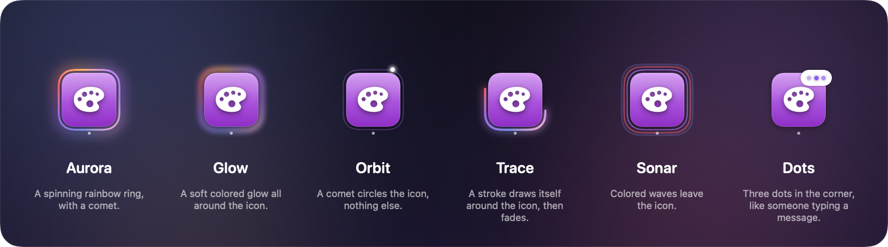
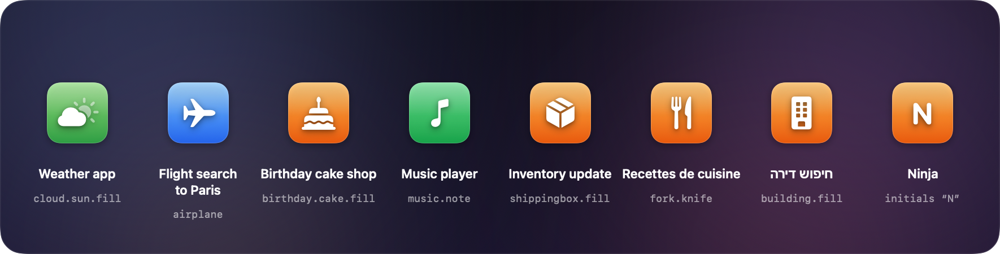

<p align="center">
  
</p>

<p align="center">
  
  
  
  
  
  
</p>

<p align="center">
  <b>One icon per Claude session. Motion only when something needs you.</b><br>
  <sub>Built for the Claude desktop app. No hooks, no setup, nothing leaves your Mac.</sub>
</p>

<p align="center">
  <a href="#install"><b>Install</b></a> ·
  <a href="#the-five-states">States</a> ·
  <a href="#hover-it-tells-you-what-it-needs">Hover card</a> ·
  <a href="#drop-it-anywhere">Placement</a> ·
  <a href="#design">Design</a> ·
  <a href="#how-it-works">How it works</a> ·
  <a href="#settings">Settings</a>
</p>

---

## Why Halo

Working with an AI coding agent means waiting. With three or four Claude sessions running in parallel, you keep switching between them just to check whether one has finished or is stuck on a question. Every check breaks your focus. Meanwhile, a session can sit idle for ten minutes because nobody saw its question.

**Halo puts that information in your peripheral vision**, the way the macOS Dock does for apps: each session gets its own Apple-style icon in a floating bar.

> **Prior art.** Before building it, I surveyed about 25 open-source projects that show Claude Code status on a Mac, from notch companions (*coucou*, *open-vibe-island*, *notchi*) to floating panels (*ccglance*). Almost all of them watch **terminal** sessions and live in the **notch**. Halo is built for the **Claude desktop app** first, takes the shape of the **Dock**, and needs **no hooks**.

---

## The five states

<p align="center">
  
</p>

| State | You see | It means |
|---|---|---|
| **Working** | Aurora glow, an orbiting comet, a breathing tile | Claude is running a turn |
| **Needs you** | Red pulse, a ripple, Dock-style bounces, `!` badge | A question or a permission is waiting for you |
| **Done** | A green ring drawn in a burst of sparks, `✓` badge | The turn ended after you last looked at the session |
| **Idle** | A quiet icon with the Dock's running dot | Nothing to do, already seen |
| **Paused** | Dimmed icon, moon badge, no running dot | In the Claude app's list, but not running |

**Six ways to show work.** Pick how a working session looks in **Settings → Animations**, where all six play live side by side:

<p align="center">
  
</p>

The green state clears itself as soon as you open the session in the Claude app.

---

## Hover: it tells you what it needs

<p align="center">
  
</p>

Hover any icon to see a small card: the **exact question** with its choices, the **command or file** a permission is about, what the session is **doing right now**, or the first lines of its **last reply**. It is read from the session's transcript on your disk: no API key, no network, no cost.

| Gesture | What happens |
|---|---|
| **Click** | Jumps to that session in the Claude app |
| **⌥-click** | Opens a pane on the right of the Claude window (Split View) and tells you which session to pick in Claude's sidebar to show it there |
| **✕** on hover | Takes the icon off the bar. It comes back by itself on the session's next turn. |
| **Pinch** | Shrinks or grows the whole bar |
| **⚙︎** at the end of the bar | Opens Settings |
| **⌃⌥H** (configurable) | Shows or hides the bar, from any app |
| **Right-click** an icon | Open, open side by side, **pin it first**, **another icon**, remove from the bar |
| **Right-click** the bar | Sessions waiting for you, size, removed sessions, Settings, Quit |

The interface speaks English, French and Hebrew (right to left).

---

## Drop it anywhere

<p align="center">
  
</p>

Drag the bar anywhere and it stays where you drop it. Drop it within 90 pt of a screen edge and it snaps there like a magnet:

- **Left or right**: the bar turns vertical.
- **Bottom**: it sits like the Dock.
- **Top**: it melts into the notch like a Dynamic Island and stays compact. You see three icons, the most urgent first; slide the pointer along it to scroll through the others.

Or pick the edge (and the display) in **Settings → General**, without dragging. The bar can also **hide itself** when no session needs you, or over a full-screen app: it comes back as soon as one does, when you move the pointer to its place, or with the shortcut.

---

## Design

### Principles

1. **Feel native.** Halo borrows the Dock's own vocabulary: fish-eye magnification, the running dot, the bounce of an app that needs you, the divider, red badges. A Mac user understands it without reading anything.
2. **Quiet by default, loud only when needed.** Idle and paused icons never move. The most urgent state is also the loudest.
3. **Motion carries meaning.** Each animation belongs to exactly one state, so you can tell states apart in peripheral vision and without relying on color alone. Badges (`!`, `✓`, moon) repeat it in shape.

<p align="center">
  
</p>

<p align="center">
  
</p>

### Motion spec

| Effect | State | Timing | Engine |
|---|---|---|---|
| Aurora ring | Working | Conic gradient spins every **2.6 s**; glow breathes 3 ↔ 7 pt over 1.4 s; glow color cycles in 4.5 s | Core Animation |
| Comet | Working | 4 sparks (5 → 2.4 pt, opacity 1 → 0.22) orbit in **1.8 s**, each 45 ms behind the one before | Core Animation |
| Breathing | Working | White light swells to 16 % and fades, **1.1 s** each way | Core Animation |
| Light sweep | Working | A band 45 % of the tile wide, tilted 22°, crosses in 1.2 s, then rests 1.2 s | Core Animation |
| Glow style | Working | The aurora ring, 6 pt wide, blurred (Gaussian 4 pt), turning every 5 s, breathing 55 ↔ 100 % | Core Animation |
| Orbit style | Working | A faint track and a 7-spark comet (white → pink → violet) in **1.5 s** | Core Animation |
| Trace style | Working | A stroke draws the ring in 1.1 s, its start follows 0.6 s later: a lap every **1.9 s** | Core Animation |
| Sonar style | Working | Three colored waves grow ×1.2 and fade, one every 0.7 s | Core Animation |
| Dots style | Working | Three dots in a bubble light up in turn (0.16 s apart), every **1.1 s** | Core Animation |
| Alert pulse | Needs you | Glow 1 ↔ 0.3 every **0.7 s**; a ripple grows ×1.2 and fades in 1.4 s | Core Animation |
| Bounce | Needs you | **11, 8, 4 pt** bounces (legs of 0.28, 0.25, 0.2 s), then again every **20 s**, always away from the edge | SwiftUI keyframes |
| Done | Done | Ring drawn in **0.5 s** (cubic ease-out), 12 sparks over 1.2 s, then a steady glow | SwiftUI, 1.8 s |
| Magnification | Hover | Gaussian falloff (σ = 48 pt) up to **×1.55**, spring 0.26 / 0.8 | SwiftUI |
| Snap | Drop | **0.34 s** glide with a slight overshoot, curve (0.2, 1.25, 0.4, 1) | AppKit |
| Appear, badges | Changes | Springs (0.45 / 0.78) and (0.38 / 0.6) | SwiftUI |

macOS's *Reduce motion* setting turns the animations off and keeps the static rings and badges. Each effect can also be switched off in Settings.

<details>
<summary><b>Icon rules</b>: which symbol and gradient each session gets</summary>

<br>

The symbol and gradient come from the session's name and folder. Rules are checked in order. Short keywords must match whole words, so "ia" does not match "media".

| Subject (keywords, English and French) | Symbol | Gradient |
|---|---|---|
| Career (job, resume, cv, interview…) | `briefcase.fill` | `#5AD8F0 → #0A84B8` |
| Food (kitchen, recipe, restaurant…) | `fork.knife` | `#FFB340 → #E8590C` |
| Studies (course, exam, study, school…) | `graduationcap.fill` | `#8E8CFF → #4B3FD6` |
| Audio (voice, podcast, transcription…) | `waveform` | `#FF7A95 → #D7264A` |
| Events (wedding, event, invitation…) | `heart.fill` | `#FF9EC0 → #E2457A` |
| Money (finance, budget, invoice…) | `chart.line.uptrend.xyaxis` | `#5EE08A → #15A34A` |
| Testing (test, qa, bug…) | `checkmark.seal.fill` | `#6FD8FF → #0A6CFF` |
| Backend (api, server, database, migration…) | `server.rack` | `#7AD7C9 → #1F8A7A` |
| Mobile (mobile, ios, android…) | `iphone` | `#9EB4FF → #4458D6` |
| Security (security, auth, audit…) | `lock.shield.fill` | `#9A9AA2 → #3A3A40` |
| Design (design, logo, brand, ui…) | `paintpalette.fill` | `#D07CFF → #8E2DC5` |
| Video (video, film, trailer) | `film.fill` | `#FF8A5C → #C2410C` |
| Travel (travel, flight, trip…) | `airplane` | `#7CC4FF → #2563EB` |
| Websites (website, landing, domain, seo…) | `globe` | `#64C8FF → #0066E0` |
| Files (files, folder, cleanup…) | `folder.fill` | `#7EC8FF → #1E88E5` |
| Halo itself | `circle.hexagongrid.fill` | `#9AA4FF → #5B5FE0` |
| AI (agent, ai, mcp, llm…) | `sparkles` | `#F2A07B → #C2603A` |
| Ideas (idea, brainstorm, project…) | `lightbulb.fill` | `#FFD84D → #F59E0B` |
| Anything else | A symbol made from the name (below), or its initials | after the symbol's Apple category |

**Icons made for each session.** When no rule fits, Halo makes one. It reads the words of the session's name and folder, translates common French and Hebrew words, and looks them up in the catalog of SF Symbols that macOS itself ships, with the keywords Apple's own search uses (about 7,000 symbols). Rare words count more than common ones, so "Flight search" gets an airplane, not a magnifying glass. The color follows the symbol's Apple category: health is red, nature green, devices indigo. Nothing matches? Its initials. All of it happens on your Mac: no AI, no network.

<p align="center">
  
</p>

Don't like one? Right-click the icon → **Another icon** moves to the next candidate. In **Settings → Icons**, each of your sessions has **Another** and **Keep** (which turns the icon into a rule you can fine-tune), and you can choose initials or a plain sparkle instead.

**Your own icons.** Add your own rules in **Settings → Icons**: keywords, a symbol (search all of Apple's symbols, in English, French or Hebrew, or type any SF Symbol name) and two colors, with a field to test a session name. They are checked first and stay on your Mac, in `~/Library/Application Support/Halo/icon-rules.json`:

```json
[
  { "keywords": ["acme", "client"], "symbol": "building.2.fill", "top": "#64C8FF", "bottom": "#0066E0" }
]
```

</details>

<details>
<summary><b>Layout</b>: sizes, notch island, compact scrolling, hover card</summary>

<br>

- **Icon** 46 pt by default (26–76). Padding is 10 pt and the bar's corner radius 22 pt, both scaling with the icon. Spacing is 8 pt (scaled) plus 4 pt on each side for the rings, so two working neighbours never touch.
- **Divider** between live and paused sessions, 70 % of the icon height, like the Dock's.
- **Hover** picks the icon under the pointer with 16 pt of stickiness, so reaching for a corner ✕ never slips to the neighbour.
- **Notch island**: a square top flush with the screen edge, 10 pt outward "ears" where it meets the menu bar, and a 22 pt rounded bottom. It is at least as wide as the notch plus 48 pt.
- **Compact scrolling**: the pointer's position along the island maps linearly to the scroll offset. 18 pt fades show only on sides that have more icons, with a 34 pt scroll indicator underneath.
- **Hover card** (290 pt wide): a colored dot and the name, the state title in small caps, up to four lines, an optional monospaced block, up to four choices, and a one-line hint.

</details>

---

## How it works

<p align="center">
  
</p>

Halo reads three things Claude already keeps on disk, and never writes to them.

| Source | What Halo takes | How often |
|---|---|---|
| `~/.claude/sessions/<pid>.json` | Live status `busy` / `idle` / `waiting` (+ why), name, folder, ids | Every 0.5 s |
| `~/Library/Application Support/Claude/claude-code-sessions/*/*/local_*.json` | Titles, paused sessions, archived flag, `lastFocusedAt` | Every 1 s, first 8 KB of changed files |
| `~/.claude/projects/<folder>/<session id>.jsonl` | Last tool call or reply, for the hover card | On hover only, last 384 KB, cached |
| `/System/Library/CoreServices/CoreGlyphs.bundle/…/symbol_*.plist` | SF Symbols names, Apple's search keywords and categories, for generated icons | Once, at launch |

- **Done vs idle.** A session is *done* if Halo saw its turn end (busy or waiting, then idle) after you last looked at it. "Looked" means its `lastFocusedAt` in the Claude app, a click on the icon, or the app being in front with that session showing. Status changes during a process's first 15 s are its boot, so relaunching Claude doesn't turn everything green.
- **Opening.** A click opens `claude://code/continue?session=local_…`. For ⌥-click, Halo uses the Accessibility API to press *Split View → New Session on the Right* in the Claude app's own menu (its title is read from the app's translation files, so this works in any language). Claude's session link always lands in the main pane and the app offers no other way in, so Halo cannot put an existing session in the new pane by itself: a short note tells you which session to click in the sidebar.

<details>
<summary><b>Source map</b></summary>

<br>

| File | Role |
|---|---|
| `AppController.swift` | Floating panel, snapping, position, auto-hide, mouse tracking (hover, drag, pinch, click-through), opening, sounds, notifications |
| `SessionStore.swift` | Reads the registry and the desktop sessions; computes the five states; order, pins, project filter, removed sessions |
| `Session.swift` | Session model, states, icon rules |
| `DockView.swift` | The bar: rows, icons, badges, ✕, bounce, done celebration, notch island, glass |
| `LayerEffects.swift` | Core Animation effects: the six working styles, alert pulse, breathing, light sweep |
| `SessionDetail.swift` | Transcript reading and the hover card |
| `SplitOpener.swift` | Side-by-side opening through the Claude app's menu |
| `Settings.swift` | Settings model and the tabbed Settings window (live preview, shortcut recorder) |
| `IconRules.swift` | Your icon rules, generated-icon picks, and the symbol choices |
| `Symbols.swift` | Apple's SF Symbols catalog (from macOS) and the icon generator |
| `Notifier.swift` | macOS notifications |
| `HotKey.swift` | The global shortcut (Carbon hot key) |
| `Localization.swift` | Every interface string in English, French and Hebrew |
| `DockMetrics.swift` | Shared geometry |
| `ReadmeArt.swift` | This README's artwork, drawn by Halo's own views |
| `Debug.swift`, `main.swift` | Entry point and command-line tools |

</details>

### Performance

Halo stays open all day, so it has a budget of **about 1 % of one CPU core** with sessions working. These numbers come from measuring each approach:

| Approach | CPU, 1–3 working sessions |
|---|---|
| SwiftUI `TimelineView` redrawing blurred glows at 45 fps | ~13–17 % |
| Same, GPU-rendered (`drawingGroup`) at 30 fps | ~12 % |
| SwiftUI `symbolEffect`, forcing a relayout every frame | ~40 % |
| **Core Animation layers (current)** | **~1 %** |

All continuous effects now run as Core Animation layers, which the system's render server animates (as it does for the real Dock). SwiftUI only animates short, event-driven moments.

### Privacy

- **Read-only on Claude.** Halo never writes to Claude's files. It only writes its own settings and your icon rules (`~/Library/Application Support/Halo`).
- **Offline.** No network, no analytics, no API key.
- **Your call.** Side-by-side opening needs the Accessibility permission, and notifications need macOS's permission; only you can grant them. Everything else works without either.

---

## Settings

<p align="center">
  
</p>

Click the **⚙︎** at the end of the bar (or right-click → *Settings…*). Five tabs, like Safari's settings; every change applies live and is saved instantly:

| Tab | What you set |
|---|---|
| **General** | Language · open at login · the global shortcut · side-by-side permission · **position** (edge and display) · **auto-hide** (when nothing needs you, over full-screen apps) · defaults |
| **Appearance** | A **live preview** of the bar · icon size · **zoom on hover** (on or off, strength, in the notch too) · icons shown in the notch |
| **Sessions** | Paused sessions · **icon order** (opened, recent, by name, waiting first) and pins · **projects shown** · hover card · removed sessions, one by one |
| **Animations** | **Six working styles, live** · each effect on or off · sounds · **macOS notifications**, clickable |
| **Icons** | **Icons made for your sessions** (another one, keep it) · how sessions without a rule look · **your own rules**, with a search through all of Apple's symbols |

Light or dark: the bar, the cards and the notes follow your Mac's appearance.

<details>
<summary><b>All settings and their defaults</b></summary>

<br>

| Setting | Default |
|---|---|
| Language | Automatic (your Mac's language; English, French or Hebrew) |
| Icon size | 46 pt (26–76) |
| Zoom on hover | On, ×1.55 (up to 2); not in the notch |
| Icons visible in the notch | 3 (2–5) |
| Show paused sessions | On, active within 7 days, at most 6 |
| Hover card details | On |
| Working style | Aurora (also Glow, Orbit, Trace, Sonar, Dots) |
| Animate sessions at work | On |
| Bounces when a session needs you | On |
| Sparks when a session is done | On |
| Sound when a session needs you / is done | Off (system sounds *Glass* / *Pop*) |
| Notification when a session needs you / is done | Off |
| Hide the bar when nothing needs you / over full-screen apps | Off / Off |
| Icon order | In the order opened (pinned sessions first) |
| Sessions without a rule | Symbol guessed from the name |
| Show or hide the bar | ⌃⌥H (record any shortcut, or clear it) |
| Open Halo at login | Off |

The window also shows the Accessibility status, removed sessions (with a button to bring them back), and *restore defaults*.

</details>

> **Three languages.** The interface speaks **English, French and Hebrew**, with the Settings window and hover cards laid out right to left in Hebrew. By default it follows your Mac's language; change it at the top of Settings.

---

## Install

**Requirements:** a Mac with **macOS 15 Sequoia or later**, and [Claude Code](https://claude.com/claude-code) (desktop app or CLI). Halo shows the sessions of the Claude desktop app and of Claude Code in the terminal.

### Option 1: download the app

1. Download **`Halo.zip`** from the [latest release](https://github.com/belhassen-raphael99/halo/releases/latest).
2. Unzip it and move **Halo.app** to your **Applications** folder.
3. Open it. Builds are not notarized yet, so macOS warns that it cannot verify the developer. Go to **System Settings → Privacy & Security** and click **Open Anyway** (once).
   Or, in Terminal:
   ```bash
   xattr -dr com.apple.quarantine /Applications/Halo.app
   ```

### Option 2: build from source

You need the Xcode command-line tools (Swift 6). If you don't have them: `xcode-select --install`.

```bash
git clone https://github.com/belhassen-raphael99/halo.git
cd halo
./scripts/build-app.sh --install
```

This compiles Halo, puts **Halo.app** in `~/Applications` and launches it. No warning, since you built it yourself.

### After launch

- **Halo has no Dock icon: it is the bar.** It appears at the bottom of your screen. Right-click it for its menu.
- **Optional: side by side.** ⌥-click an icon once and allow Halo in **System Settings → Privacy & Security → Accessibility**.
- **Optional: start with your Mac.** Right-click the bar → *Open Halo at login*.
- **Language.** Halo follows your Mac's language (English, French or Hebrew). Change it at the top of Settings.

### Uninstall

Right-click the bar → *Quit Halo*, delete **Halo.app**, and if you wish, its settings:

```bash
defaults delete com.belhassen.halo
```

---

## For developers

```bash
swift build -c release                                # compile
.build/release/Halo --dump [en|fr|he]                 # every session, its state, and what its hover card says
.build/release/Halo --status                          # what the running bar reports: permission, shortcut, icons…
.build/release/Halo --snapshot <dir>                  # renders the bar in each placement as PNGs
.build/release/Halo --icons "Weather app" "…"         # the icon Halo would make for each name, and the runners-up
.build/release/Halo --readme docs/readme              # regenerates this README's artwork
.build/release/Halo --appicon Resources/AppIcon.icns  # regenerates the app icon
```

> **Signing.** macOS ties the Accessibility permission to the app's signature. Run `./scripts/make-signing-cert.sh` once: it creates a local "Halo Developer" certificate in your login keychain, and `build-app.sh` then signs every build with it, so the permission survives rebuilds. Without it, builds are signed ad hoc and you have to grant the permission again after each rebuild.

### Limitations and roadmap

- **Undocumented formats.** Halo reads Claude's internal files, so a Claude update can break it. `--dump` shows what changed.
- **No answering from the bar.** Halo cannot type into a session; a click takes you there.
- **✕ removes, it doesn't archive.** The Claude app offers no safe way for another app to close a session.
- **Next:** notarized releases, a Homebrew cask, terminal sessions jumping to their tab, and a demo video.

---

<p align="center">
  <br>
  <sub>Halo · MIT License · made with SwiftUI and Core Animation by <a href="https://github.com/belhassen-raphael99">Raphael Belhassen</a></sub>
</p>
